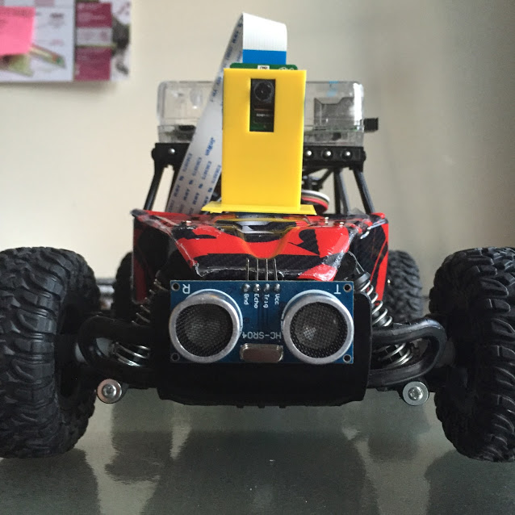
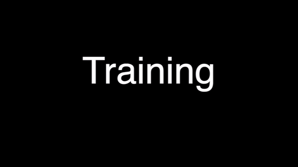
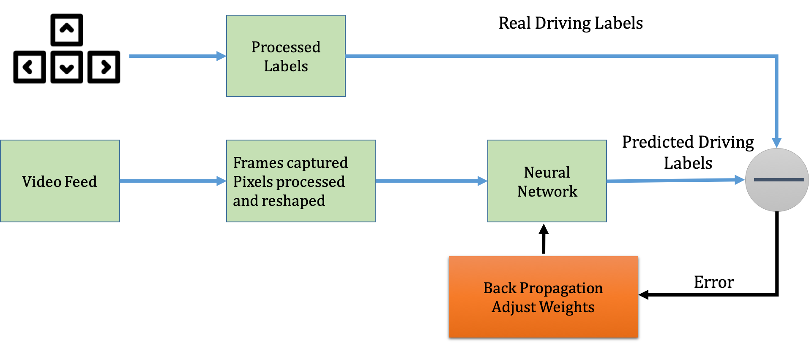
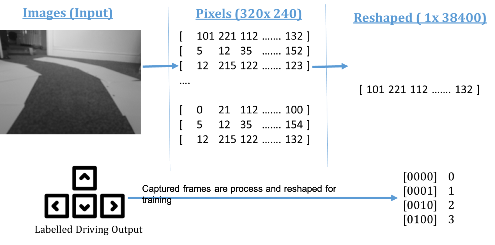

# Neural Network Self Driving Car

I Built a real-time autonomous navigation radio-controlled car by prototyping a platform to test machine learning algorithms through a combination of robotics controls and computer vision using an Arduino, Raspberry Pi, and suitable sensors. Python and C were used to pre-process and transform raw data sets from a video camera feed the car to the right level of granularity for analysis using neural networks to generate and test a model.


## Modified RC Car



## Hardware
```
Ultrasonic Sensors
Motor controller
Pi- Camera
Raspberry PI 
PC ( Processing)
```


## Nerual Network Demo  
Successfully traversing a race track. 







  
## Dependencies
```
* Raspberry Pi: 
  - Picamera
* Arduino Uno: 
* Computer:
  - Numpy
  - OpenCV
  - Pygame
  - PiSerial
  ```
  
  

###Acknowledgements 
The project was inspired by :
[Zhang Wang Self Driving Car Model ](https://zhengludwig.wordpress.com/projects/self-driving-rc-car/ " Test")

Ryan Zotti: How to Build Your Own Self Driving Toy Car | PyData DC 2016
 [PyData Conference](https://www.youtube.com/watch?v=QbbOxrR0zdA)
